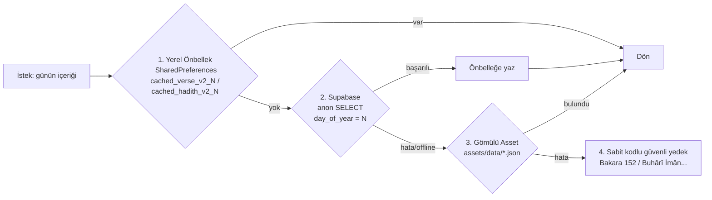
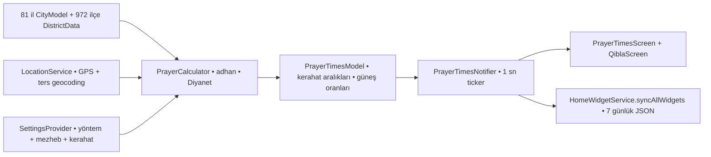

# Vakit • GRAPH.md — Uygulama Özellik Haritası (Grapify)

> 🧭 **Bu dosya nedir?** Vakit uygulamasının tüm özelliklerinin, ekranlarının, servislerinin, veri kaynaklarının, yerel depolama anahtarlarının ve bağımlılıklarının **tek dosyalık canlı haritasıdır**. Yeni her geliştirme oturumu **önce bu dosyayı okumalıdır**: [agent.md](agent.md) gelişim günlüğü, GRAPH.md ise o günlüğün ürettiği güncel mimari haritadır. Yeni bir özellik eklendiğinde veya değiştirildiğinde bu dosya mutlaka güncellenir.
>
> 📅 Son doğrulama: **2026-10-02** • Sürüm: **v1.4.0+5** • Canlı Supabase bağlantısı anon okuma ile test edildi ✅

---

## 1. Uygulama Kimliği

| Alan | Değer |
|---|---|
| Ad | **Vakit** |
| Paket adı | `com.vakit.vakit` (pubspec: `vakit`) |
| Sürüm | `1.4.0+5` ([pubspec.yaml](pubspec.yaml)) |
| Platformlar | Android (birincil, widget + native pusula motoru), Flutter çoklu-platform temeli hazır |
| Dil | Tamamen Türkçe (tr_TR locale) |
| Kimlik/veri politikası | Kullanıcı girişi yok, kişisel veri toplanmaz, `anon` read-only Supabase |
| Depo | [abdulsamet-kasal/vakit](https://github.com/abdulsamet-kasal/vakit) |
| Mimari | Feature-first (`lib/features/*` + `lib/core/`) |

---

## 2. Teknoloji Yığını

| Katman | Teknoloji |
|---|---|
| Çatı | Flutter 3.47+ / Dart 3.13+ |
| State | `flutter_riverpod` (modern `Notifier` / `NotifierProvider`) |
| Rota | `go_router` (`ShellRoute` + `vakit://` deep-link redirect) |
| Vakit hesabı | `adhan` (Diyanet yöntemi, **tamamen cihaz üstü, internetsiz**) |
| Konum | `geolocator` + `geocoding` |
| Pusula | `flutter_compass` + **native Kotlin EventChannel motoru** (`com.vakit.vakit/compass`) |
| Bulut | `supabase_flutter` (anon read-only) + `flutter_dotenv` (`.env`) |
| Yerel depolama | `shared_preferences` (ayarlar, şehir, içerik önbelleği) |
| Widget köprüsü | `home_widget` (Flutter ⇄ Android RemoteViews) |
| Tarih | `hijri` (Hicri takvim) + `intl` (tr_TR biçimlendirme) |
| Tipografi | `google_fonts` (Amiri, Newsreader, Source Sans 3) |
| Paylaşım | `share_plus` + `path_provider` (PNG kart export) |

---

## 3. Özellik Ağacı (Feature Tree)

```mermaid
graph TD
    A[Vakit v1.5.0] --> B[Vakitler / Ana Ekran]
    A --> C[Kıble Pusulası]
    A --> D[Günün Âyeti]
    A --> E[Günün Hadisi]
    A --> F[Ayarlar]
    A --> G[Android Widget Sistemi]
    A --> H[Çekirdek Çizim Sistemi]
    A --> I[Ezan Bildirimleri]

    B --> B1[Mihrap geri sayım kartı • 1 sn canlı sayaç]
    B --> B2[Güneş Yayı + 3 kerahat dilimi]
    B --> B3[Dikey zaman şeridi • Şu An göstergesi]
    B --> B4[81 il + 972 ilçe seçimi • GPS tespiti]
    B --> B5[Gün değiştirme çubuğu • Miladi + Hicri]
    B --> B6[Kerahat rozetleri • canlı durum]

    C --> C1[Native 4 katmanlı sensör füzyonu]
    C --> C2[Kıble açısı + Kâbe km mesafesi]
    C --> C3[Dairesel low-pass filtre • yumuşak dönüş]
    C --> C4[Hizalanma haptiği + 8 çizme kalibrasyonu]
    C --> C5[Sensörsüz cihaz statik rehberi]

    D --> D1[Amiri hat + Türkçe meâl]
    D --> D2[Kopyala • metin paylaş • PNG kart paylaş]
    D --> D3[Önceki/sonraki gün gezinme]

    E --> E1[Arapça + Türkçe hadis + ravi + kaynak]
    E --> E2[Kopyala • metin paylaş • PNG kart paylaş]
    E --> E3[Önceki/sonraki gün gezinme]

    F --> F1[Hesaplama yöntemi diyaloğu • 7 yöntem]
    F --> F2[İkindi mezhebi • Şâfiî / Hanefî]
    F --> F3[3 kerahat süresi slider'ı]
    F --> F4[Açık/Koyu/Sistem teması]
    F --> F5[Supabase bağlantı rozeti]

    G --> G1[Small 2x2 • canlı Chronometer sayaç]
    G --> G2[Medium 4x2 • 6 vakit + pirinç çizgi]
    G --> G3[Strip 4x1 • kompakt şerit]
    G --> G4[Verse 4x2 • günün âyeti]
    G --> G5[Hadith 4x2 • günün hadisi]
    G --> G6[Hassas AlarmManager • BootReceiver]
    G --> G7[Serbest yeniden boyutlandırma]
    G --> G8[vakit:// deep link yönlendirme]

    H --> H1[MihrapClipper • MihrapContainer]
    H --> H2[IslamicPatternPainter • girih doku]
    H --> H3[MushafCard • AyahEndRosette]
    H --> H4[KerahatBadge • SunArcPainter]

    I --> I1[Ezan + ön hatırlatma • sessiz mod]
    I --> I2[7 günlük olay kuyruğu • notif_events_json]
    I --> I3[NotificationAlarmReceiver • sonraki alarma geçiş]
    I --> I4[BootReceiver ile alarm tazeleme]
    I --> I5[Bildirim sesi seçimi • titreşim anahtarı]
    I --> I6[Kalıcı namaz çubuğu • PrayerBarNotification]
```



---

## 4. Ekranlar, Rotalar ve Deep Link'ler

### 4.1 Rotalar ([lib/routing/app_router.dart](lib/routing/app_router.dart))

| Rota | Ad | Ekran | Feature | Erişim |
|---|---|---|---|---|
| `/vakitler` (başlangıç) | `prayer_times` | `PrayerTimesScreen` | prayer_times | Alt menü sekme 1 |
| `/kible` | `qibla` | `QiblaScreen` | qibla | Alt menü sekme 2 |
| `/ayet` | `verse` | `DailyVerseScreen` | daily_content | Alt menü sekme 3 |
| `/hadis` | `hadith` | `DailyHadithScreen` | daily_content | Alt menü sekme 4 |
| `/ayarlar` | `settings` | `SettingsScreen` | settings | Alt menü sekme 5 |
| `/preview` | `preview` | `DesignPreviewScreen` | preview | Menü dışı, tasarım önizleme |

- 5 sekme, `ShellRoute` içinde `MainScaffoldShell` (animasyonlu pill göstergeli) ile sarmalanır.
- `redirect`: `vakit://` şemalı tüm URI'lar iç ekranlara çevrilir.

### 4.2 Widget Deep Link'leri (AndroidManifest + `HomeWidgetService`)

| URI | Hedef | requestCode (PendingIntent) |
|---|---|---|
| `vakit://vakitler` | `/vakitler` | 101 |
| `vakit://kible` | `/kible` | 102 |
| `vakit://ayet` | `/ayet` | 103 |
| `vakit://hadis` | `/hadis` | 104 |
| `vakit://ayarlar` | `/ayarlar` | 105 |

Cold-start açılışı `HomeWidgetService.checkInitialLaunch()` (post-frame callback) ile, sıcak açılış `MainActivity.onNewIntent` + `setIntent` + `widgetClicked` akışı ile yakalanır.

---

## 5. State Yönetimi — Riverpod Envanteri

| Provider | Tip | State | Görev |
|---|---|---|---|
| `prayerTimesProvider` | `NotifierProvider<PrayerTimesNotifier, PrayerTimesState>` | seçili tarih/şehir, 6 vakit, yarınki vakitler, 1 sn'lik sayaç, aktif kerahat, güneş ilerlemesi | Vakit ekranının kalbi; şehir/tarih değişimi, GPS tespiti, widget senkron tetikleyicisi |
| `qiblaProvider` | `NotifierProvider<QiblaNotifier, QiblaState>` | heading, kıble açısı, km mesafe, hizalanma, sensör durumu, kalibrasyon ihtiyacı | Kıble kontrolcüsü. **Kritik:** `prayerTimesProvider`'ı tamamıyla değil, yalnızca `selectedCity` üzerinden `select` ile izler — 1 sn'lik canlı sayaç kıbleyi yeniden kurmaz (v1.4.0 düzeltmesi) |
| `dailyContentProvider` | `NotifierProvider<DailyContentNotifier, DailyContentState>` | seçili tarih + `AsyncValue<VerseModel>` + `AsyncValue<HadithModel>` | Günün âyet/hadis yükleme, gün gezinme, bugünkü içerikse widget güncelleme |
| `settingsProvider` | `NotifierProvider<SettingsNotifier, AppSettingsModel>` | hesaplama yöntemi, mezheb, kerahat süreleri, tema, **ezan bildirimi ayarları** | Ayar kalıcılığı (SharedPreferences) + değişimde vakitleri yeniden hesaplar + `_resyncNotificationAlarms` ile bildirim planını tazeler |
| `themeModeProvider` | `NotifierProvider<ThemeModeNotifier, ThemeMode>` | `ThemeMode` | Uygulama temasını yükler/kaydeder/uygular |

---

## 6. Veri Katmanı ve Kaynak Önceliği

### 6.1 Günlük İçerik (âyet/hadis) — Katı Öncelik Sırası



- `N` = `((yılınGünü − 1) mod 30) + 1` → 30 içerik, yıl boyunca döngüsel döner (`DailyContentRepository.getSeedDayOfYear`).
- `getVerseRange` / `getHadithRange`: widget için 7 günlük toplu çekim.
- **Sıfır çökme garantisi:** `.env` boş, ağ kopuk veya asset bozuksa bile sabit yedeğe düşer.

### 6.2 Namaz Vakitleri Veri Akışı



- GPS: izin reddedilirse/gps kapalıysa `null` → arama yapılabilir 81 il + ilçe listesine düşer, **asla çökmez**.
- Ters geocoding başarısızsa en yakın il koordinat mesafesiyle bulunur.

---

## 7. Supabase (Bulut Veritabanı)

| Alan | Değer |
|---|---|
| Proje URL | `https://xaecjfimbcqoutpqmwyq.supabase.co` (`.env` içinde: `SUPABASE_URL`) |
| Anahtar | `SUPABASE_ANON_KEY` — **yalnızca** anon/public anahtar; `service_role` kesinlikle uygulamaya konmaz |
| Başlatma | `main.dart` → `Supabase.initialize` (try/catch; başarısızsa çevrimdışı devam) |
| Erişim | `anon` + `authenticated` rolleri için **salt okunur SELECT** RLS politikaları |
| Canlı doğrulama | 2026-10-02: iki tablo da `anon` REST okuması ile erişildi ✅ |

### 7.1 Tablolar ([supabase/migrations/20261002000000_create_daily_content.sql](supabase/migrations/20261002000000_create_daily_content.sql))

**`public.daily_verses`** — 30 günün âyeti, `day_of_year` UNIQUE (1–366 kontrolü)

| Kolon | Tip | Not |
|---|---|---|
| `id` | BIGINT identity PK | |
| `day_of_year` | INT NOT NULL UNIQUE | `CHECK (1..366)` |
| `surah_no` / `ayah_no` | INT NOT NULL | Sure/ayet numarası |
| `arabic` | TEXT NOT NULL | Arapça metin |
| `meal_tr` | TEXT NOT NULL | Türkçe meâl |
| `source_name` | TEXT NOT NULL | "Fâtiha Sûresi, 2" |
| `short_text` | TEXT | Widget'ın kısa metni |
| `created_at` | TIMESTAMPTZ | UTC default |

**`public.daily_hadiths`** — 30 günün hadisi, aynı şema düzeni

| Kolon | Tip | Not |
|---|---|---|
| `id` | BIGINT identity PK | |
| `day_of_year` | INT NOT NULL UNIQUE | `CHECK (1..366)` |
| `arabic` | TEXT (nullable) | |
| `text_tr` | TEXT NOT NULL | Türkçe hadis metni |
| `narrator` | TEXT NOT NULL | Ravi |
| `source_book` | TEXT NOT NULL | Buhârî, Müslim, Tirmizî... |
| `source_no` | TEXT | Kitap içi bölüm no |
| `short_text` | TEXT | Widget'ın kısa metni |
| `created_at` | TIMESTAMPTZ | UTC default |

### 7.2 Migration ve Seed

1. `20261002000000_create_daily_content.sql` — tablolar + RLS açma + salt-okunur `SELECT` politikaları.
2. `20261002000001_seed_daily_content.sql` — 30 âyet + 30 hadis, `ON CONFLICT (day_of_year) DO UPDATE` ile idempotent seed.
3. Aynı 30+30 içerik `assets/data/daily_verses.json` ve `daily_hadiths.json` olarak APK'ya gömülü (offline güvence).

> ⚠️ Not: `pubspec.yaml`, `.env` dosyasını asset olarak paketliyor; anon anahtar APK içine gömülür. Anon anahtar RLS ile salt-okunur olduğu için bilinen tasarım kararıdır; ileride yazma yetkisi olan tablo eklenirse bu düzen değişmelidir.

---

## 8. Namaz Vakti ve Kerahat Hesap Motoru

| Bileşen | Dosya | Kurallar |
|---|---|---|
| Hesaplayıcı | [prayer_calculator.dart](lib/features/prayer_times/data/prayer_calculator.dart) | `adhan` `CalculationMethod.turkey` (varsayılan) + 7 yöntem; `calculate` (1 gün) ve `calculateRange` (7 gün, widget) |
| Kerahat yapılandırma | [kerahat_config.dart](lib/core/config/kerahat_config.dart) | Doğuş **45 dk**, İstiva **40 dk** (öğleden önce), Batış **45 dk** (akşamdan önce) — kullanıcı ayarlanabilir |
| Kerahat tespiti | [prayer_times_model.dart](lib/features/prayer_times/domain/prayer_times_model.dart) | `getActiveKerahat`: sunrise/midday/sunset/none; `PrayerTimelineList` oran aralıkları |
| Aktif vakit | aynı | `getCurrentPrayer`: İmsak öncesi gece → Yatsı; Yatsı sonrası → Yatsı |
| Sonraki vakit | aynı | `getNextPrayer`: Yatsıdan sonra ertesi günün İmsak'ına kayar (`tomorrowTimes` ile) |
| Güneş ilerlemesi | aynı | `getSunProgress`: 0.0 (doğuş) → 1.0 (batış), gece `null` |
| Canlı sayaç | [prayer_times_controller.dart](lib/features/prayer_times/presentation/controllers/prayer_times_controller.dart) | 1 saniyelik `Timer.periodic`; geçmiş günlerde sayaç referansı `imsak` saatinde donar |
| Şehir kalıcılığı | aynı | `selected_city_id/name/lat/lng/district` → SharedPreferences |

## 9. Kıble Motoru

| Bileşen | Dosya | Kurallar |
|---|---|---|
| Küresel matematik | [math_utils.dart](lib/core/utils/math_utils.dart) | Kâbe (21.4225, 39.8262); büyük daire forward azimuth + Haversine km; dairesel low-pass filtre (`alpha 0.22`); hizalanma toleransı **±3.5°** |
| Sensör servisi | [compass_service.dart](lib/features/qibla/data/compass_service.dart) | **Önce native kanal** `com.vakit.vakit/compass`; hata olursa `flutter_compass` plugin'ine düşer |
| Native motor | [CompassStreamHandler.kt](android/app/src/main/kotlin/com/vakit/vakit/CompassStreamHandler.kt) | 4 katmanlı füzyon: `TYPE_ROTATION_VECTOR` → `TYPE_GEOMAGNETIC_ROTATION_VECTOR` → `TYPE_ORIENTATION` → `ACCELEROMETER+MAGNETIC_FIELD` matris; `remapCoordinateSystem` ile ekran oryantasyonu |
| Kontrolcü | [qibla_controller.dart](lib/features/qibla/presentation/controllers/qibla_controller.dart) | `selectedCity` `select` ile izlenir (saniyelik sayaç rebuild fırtınası engellendi); sensör akışı yalnızca ilk kurulumda veya şehir değişiminde baştan kurulur; heading/accuracy state rebuild'lerinde korunur; 0–360 normalize; 4 sn veri gelmezse kalibrasyon istemi; accuracy > 25° ise tekrar kalibrasyon; hizalanmada tek seferlik `HapticFeedback.mediumImpact()`; sensörsüz cihazda statik rehber + "Tekrar Dene" |

---

## 10. Android Widget Sistemi

| Widget | Boyut | Provider | İçerik |
|---|---|---|---|
| Small | 2x2 | `VakitSmallWidgetProvider` | Sonraki vakit + ezan saati + canlı `ChronometerCountDown` + kerahat rozeti |
| Medium | 4x2 | `VakitMediumWidgetProvider` | 6 vakit + saatler + aktif vaktin pirinç çizgisi + kerahat durumu |
| Strip | 4x1 | `VakitStripWidgetProvider` | Kompakt şerit: sonraki vakit + canlı sayaç |
| Verse | 4x2 | `VakitVerseWidgetProvider` | Mushaf dokulu günün âyeti + sure/ayet no |
| Hadith | 4x2 | `VakitHadithWidgetProvider` | Mushaf dokulu günün hadisi + ravi + kaynak |

### 10.1 Veri Köprüsü ([home_widget_service.dart](lib/features/widgets_bridge/home_widget_service.dart))

- `syncAllWidgets(city)`: 7 günlük vakitler + kerahat aralıkları JSON olarak yazılır → `days_prayer_json` (+ yedek olarak `FlutterSharedPreferences` kopyası), `city_name`; ardından 5 widget topluca `updateWidget` ile tetiklenir.
- `updateDailyContent(verse, hadith)`: `today_verse_short/source`, `today_hadith_short/source/narrator` → yalnızca Verse + Hadith widget'ları güncellenir.
- Tetiklenme anları: uygulama açılışı, şehir değişimi, ayar değişimi, bugünün içeriğinin yüklenmesi.

### 10.2 Native Zamanlayıcılar

| Bileşen | Dosya | Görev |
|---|---|---|
| `VakitAlarmReceiver` | [VakitAlarmReceiver.kt](android/app/src/main/kotlin/com/vakit/vakit/VakitAlarmReceiver.kt) | Vakit/kerahat/gece yarısı geçişlerinde `setExactAndAllowWhileIdle` ile pil dostu uyanma + tüm widget'ları yenileme |
| `BootReceiver` | [BootReceiver.kt](android/app/src/main/kotlin/com/vakit/vakit/BootReceiver.kt) | `BOOT_COMPLETED`, `MY_PACKAGE_REPLACED`, `TIME_SET`, `TIMEZONE_CHANGED` → widget + alarm tazeleme |
| `VakitWidgetHelper` | [VakitWidgetHelper.kt](android/app/src/main/kotlin/com/vakit/vakit/VakitWidgetHelper.kt) | 3 katmanlı prefs okuma (`HomeWidgetPreferences` → `HomeWidgetPlugin` → `FlutterSharedPreferences`), `findTodayDayData` (gerçek gün eşleşmesi), Chronometer taban zamanı, kerahat mantığı, boş JSON'da şık yedek durumlar |
| `NotificationAlarmReceiver` | [NotificationAlarmReceiver.kt](android/app/src/main/kotlin/com/vakit/vakit/NotificationAlarmReceiver.kt) | `notif_events_json` içindeki vakti gelen olayı bildirir (`vakit_adhan` / `vakit_pre_alert` kanalları, requestCode 2001) ve sonraki olaya alarm kurar; kanala kullanıcının ses/titreşim tercihini (`notif_sound_json`) uygular; `showTestNotification` ile ayar denemesi sunar |
| `PrayerBarNotification` | [PrayerBarNotification.kt](android/app/src/main/kotlin/com/vakit/vakit/PrayerBarNotification.kt) | Bildirim çubuğunda ongoing "Bugün • şehir / 6 vakit / Sonraki vakit / kerahat" bildirimi (`vakit_prayer_bar`, IMPORTANCE_LOW); açma-kapama `prayer_bar_enabled` |
| `MainActivity` | [MainActivity.kt](android/app/src/main/kotlin/com/vakit/vakit/MainActivity.kt) | Pusula `EventChannel` kaydı + `onNewIntent`/`setIntent` deep-link aktarımı + bildirim kanalları + `POST_NOTIFICATIONS` izin isteği (kod 5001) + `com.vakit.vakit/notifications` MethodChannel (`scheduleNotifications`, `updatePrayerBar`, `sendTestNotification`, `pickNotificationSound` → sistem zil seçicisi) |

### 10.3 Manifest İzinleri ve Kabiliyetler

- İzinler: `INTERNET`, `ACCESS_FINE_LOCATION`, `ACCESS_COARSE_LOCATION`, `RECEIVE_BOOT_COMPLETED`, `SCHEDULE_EXACT_ALARM`, `POST_NOTIFICATIONS`.
- `USE_EXACT_ALARM` **kaldırıldı** (Play politikası); exact alarm yerine `canScheduleExactAlarms()` kontrolü + `setAndAllowWhileIdle` yedeği uygulandı.
- `uses-feature` (gerekli değil): `sensor.compass`, `sensor.accelerometer`.
- Deep-link şeması: `vakit://` (`VIEW` + `es.antonborri.home_widget.action.LAUNCH`).
- 5 widget receiver + `VakitAlarmReceiver` + `NotificationAlarmReceiver` + `BootReceiver` kayıtlı.

---

## 11. Tasarım Sistemi

| Token | Değer | Kullanım |
|---|---|---|
| Derin Orman Yeşili | `#0F3D2E` | Ana zemin, mihrap kartı degradesi |
| Yosun Yeşili | `#2F6B4F` | İkincil yüzeyler |
| Adaçayı | `#A9C4B0` | Narin çerçeveler |
| Parşömen | `#F3EEE0` | Açık tema arka plan, mushaf dokusu |
| Mat Pirinç | `#B8934A` | Altın vurgular, aktif vakit çizgisi |
| Kerahat Kil/Amberi | `#C27A3E` | Kerahat uyarıları |

- Fontlar: **Amiri** (Arapça), **Newsreader** (başlık/saatler, tabular figures), **Source Sans 3** (gövde).
- İmza bileşenler (`lib/core/widgets/` + painters): `MihrapClipper`/`MihrapContainer`, `SunArcPainter`, `PrayerTimelineList`, `MushafCard` + `AyahEndRosette`, `IslamicPatternPainter` (Selçuklu girih), `KerahatBadge`.
- Erişilebilirlik: `MediaQuery.withClampedTextScaling(0.85–1.35)` — [main.dart](lib/main.dart).

---

## 12. Yerel Depolama Anahtar Envanteri (SharedPreferences)

| Anahtar | Sahibi | İçerik |
|---|---|---|
| `selected_city_id` / `selected_city_name` / `selected_city_lat` / `selected_city_lng` / `selected_city_district` | PrayerTimesNotifier | Seçili il/ilçe |
| `calc_method` | SettingsRepository | adhan yöntem adı (varsayılan `turkey`) |
| `calc_madhab` | SettingsRepository | `shafi` (varsayılan) / `hanafi` |
| `sunrise_kerahat_min` / `midday_kerahat_min` / `sunset_kerahat_min` | SettingsRepository | Kerahat süreleri (45/40/45) |
| `app_theme_mode` | ThemeModeNotifier + SettingsRepository | `light` / `dark` / silinmiş = system |
| `cached_verse_v2_N` / `cached_hadith_v2_N` | DailyContentRepository | Günün içerik önbelleği (N = 1–30) |
| `days_prayer_json` / `city_name` | HomeWidgetService | Widget 7 günlük JSON + şehir (hem HomeWidget hem Flutter prefs kopyası) |
| `today_verse_short` / `today_verse_source` / `today_hadith_short` / `today_hadith_source` / `today_hadith_narrator` | HomeWidgetService | İçerik widget verileri (HomeWidgetPreferences) |
| `adhan_notification_enabled` / `pre_alert_enabled` / `pre_alert_minutes` / `adhan_silent_mode` | SettingsRepository | Ezan bildirimi ayarları (varsayılan: açık / kapalı / 15 dk / sessiz) |
| `notification_sound_uri` / `notification_vibration` / `prayer_bar_notification_enabled` | SettingsRepository | Bildirim sesi (content URI; yoksa sistem varsayılanı), titreşim, kalıcı namaz çubuğu (varsayılan: true/true/true) |
| `notif_events_json` | NotificationSchedulerService → NotificationAlarmReceiver | 7 günlük bildirim olayları + sonraki alarm zamanı (HomeWidgetPreferences) |
| `notif_sound_json` / `prayer_bar_enabled` | NotificationSchedulerService → Kotlin | Ses/ titreşim/ sessizlik yapılandırması ve çubuk açma-kapama (Kotlin'in okuyabildiği HomeWidget anahtarları) |

---

## 13. Paylaşım Sistemi

- [share_card_exporter.dart](lib/core/utils/share_card_exporter.dart): `RepaintBoundary` → 3.0 pixelRatio PNG → geçici dosya → `SharePlus` kart paylaşımı; boundary yoksa/hata olursa düz metin fallback.
- Âyet/hadis ekranlarında üç paylaşım yolu: kopyala, metin paylaş, görsel kart paylaş.

---

## 14. Test Envanteri ([test/](test))

| Test | Kapsam |
|---|---|
| [prayer_calculation_test.dart](test/features/prayer_times/prayer_calculation_test.dart) | İstanbul/Ankara Diyanet takvimi ±2 dk uyumu, kronoloji, kerahat aralıkları, 7 günlük hesap |
| [qibla_math_test.dart](test/features/qibla/qibla_math_test.dart) | Kıble açısı/mesafe doğrulamaları, dairesel filtre, hizalanma toleransı |
| [daily_content_repository_test.dart](test/features/daily_content/daily_content_repository_test.dart) | Deterministik günlük seçim, offline asset güvencesi |
| [district_test.dart](test/features/prayer_times/district_test.dart) | 81 il / 972 ilçe veri bütünlüğü |
| [diyanet_turkey_wide_test.dart](test/features/prayer_times/diyanet_turkey_wide_test.dart) | 7 il için AlAdhan `method=13` (Diyanet) referanslı ±2 dk uyum + İstanbul-Hakkâri akşam farkı; çevrimdışı |
| [notification_settings_test.dart](test/features/settings/notification_settings_test.dart) | Bildirim sesi/titreşim/çubuk varsayılanları, etiketlendirme, `copyWith` ve SharedPreferences kalıcılığı |
| [widget_test.dart](test/widget_test.dart) | Tema köprüsü |

> 33 test, `flutter analyze` 0 hata ile v1.6.0'da doğrulandı (agent.md).

---

## 15. Mimari Bağımlılık Grafiği

```mermaid
graph TB
    subgraph Flutter
        MAIN[main.dart • EnvConfig • Supabase.init • HomeWidgetService.init] --> ROUTER[appRouter • vakit:// redirect]
        MAIN --> THEME[themeModeProvider]
        ROUTER --> SHELL[MainScaffoldShell • 5 sekme]
        SHELL --> S1[PrayerTimesScreen]
        SHELL --> S2[QiblaScreen]
        SHELL --> S3[DailyVerseScreen]
        SHELL --> S4[DailyHadithScreen]
        SHELL --> S5[SettingsScreen]
        S1 --> PT[prayerTimesProvider]
        S2 --> QB[qiblaProvider]
        S3 & S4 --> DC[dailyContentProvider]
        S5 --> ST[settingsProvider]
        QB --> PT
        ST --> PT
        PT --> CALC[PrayerCalculator • adhan] & LOC[LocationService • GPS]
        DC --> REPO[DailyContentRepository]
        REPO --> SUPA[(Supabase anon read-only)] & ASSETS[(assets/data/*.json)] & CACHE[(SharedPreferences önbellek)]
        PT & DC & ST --> HW[HomeWidgetService]
    end
    HW -. home_widget kanalı .-> KOTLIN[Android native: VakitWidgetHelper • 5 Provider • Alarm/BootReceiver]
    QB --> CH[CompassService EventChannel com.vakit.vakit/compass]
    CH -. .-> CSH[CompassStreamHandler • 4 katman sensör füzyonu]
```

---

## 16. Konfigürasyon ve Ortam

| Değişken | Dosya | Açıklama |
|---|---|---|
| `SUPABASE_URL` | `.env` | Supabase proje adresi (şablonda boş: `.env.example`) |
| `SUPABASE_ANON_KEY` | `.env` | Public anon anahtar |
| Yükleme stratejisi | [env_config.dart](lib/core/config/env_config.dart) | `.env` yoksa/boşsa `hasSupabaseConfig = false` → tamamen çevrimdışı mod, **çökme yok** |
| Build varlığı | `assets/env/env.properties` | `pubspec.yaml`'a `assets/env/` eklenerek `.env` olmadan da release derlemesi çalışır; gerçek `.env` gitignore'dadır |

---

## 17. Bilinen Kısıtlar ve Açık Noktalar

1. **iOS widget yok:** `widgets_bridge` Android RemoteViews odaklı; `appGroupId` tanımlı ama WidgetKit tarafı yazılmadı.
2. **30 içerik döngüsü:** Âyet/hadis havuzu 30'ar adet; yılın 331+ günü içerik tekrar eder. Havuz büyütülürse `totalSeedCount` ve seed SQL + asset JSON birlikte güncellenmeli.
3. **Anon anahtar APK içinde:** `.env` asset olarak paketleniyor (bkz. §7 uyarısı) — salt-okunur RLS ile güvence altında.
4. **İlçe koordinatları yok:** İlçe seçimi isim düzeyinde; vakit hesabı il merkezi koordinatlarıyla yapılır.
5. **Bildirim yalnızca Android:** Ezan bildirimi `AlarmManager` + `home_widget` veri köprüsüne dayanır; iOS tarafı (WidgetKit/UserNotifications) yazılmadı.
6. **Bildirim havuzu 7 gün:** Olay kuyruğu 7 günlük üretilir; uygulama 7 günden uzun süre açılmazsa `syncAllWidgets` tekrar planlayana kadar sessiz kalır (açılışta otomatik tazelenir).
7. **Kalıcı çubuk içeriği mutlak saattir:** "Sonraki vakit" satırı yalnızca yukarıdaki tetikleyicilerde tazelenir; geri sayım gösterilmez, böylece bayat bilgi oluşmaz.

---

## 18. Sürüm Geçmişi Özeti

| Sürüm | Odak |
|---|---|
| v1.0.0 | Temel özellikler, widget'lar, tasarım sistemi, release |
| v1.2.0 | Widget boyutlandırma + gün seçimi düzeltmeleri, 972 ilçe, native Kotlin pusula motoru |
| v1.3.0 | RemoteViews `<View>` onarımı, 4 katmanlı sensör füzyonu, lüks pusula kadranı, modern ana ekran |
| v1.4.0 | Kıble ekranı kökten onarımı: saniyelik rebuild fırtınası (`select` düzeltmesi), sensör akışı kararlılığı, sensörsüz cihaz statik rehberi |
| v1.5.0 | Ezan bildirimleri (7 günlük olay kuyruğu + native alarm), âyet/hadis kaynaklı doğrulama (30/30), Diyanet 7 il testi, alarm izinleri Play politikasına uygun hale getirildi, `.env` build güvencesi, LICENSE + README, masaüstü/web klasörleri kaldırıldı |
| v1.6.0 (mevcut) | Bildirim sesi seçimi (sessiz/sistem/cihazdan), kalıcı namaz çubuğu bildirimi, titreşim anahtarı, test bildirimi, Dart↔Kotlin bildirim MethodChannel'ı devreye alındı |

---

## 19. Harita Bakım Kuralları (Bu Dosyayı Kullanma Sözleşmesi)

1. Her yeni oturumda **önce GRAPH.md okunur**; özellik ekleme/değişiklik sonrası ilgili bölüm burada güncellenir.
2. Yeni ekran → §4 rotalar + §5 provider + §3 ağaç; yeni tablo → §7; yeni `SharedPreferences` anahtarı → §12; yeni widget veri anahtarı → §10.1.
3. [agent.md](agent.md) gelişim günlüğü olarak kalmaya devam eder; mimari gerçekler GRAPH.md'dedir.
